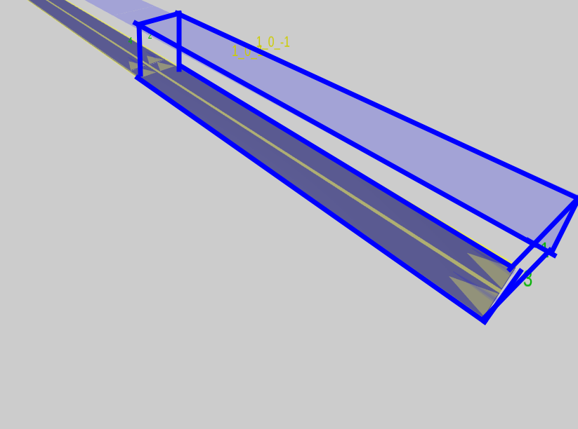
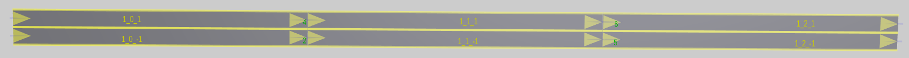

# Maliput FAQ <!-- omit from toc -->

- [Maliput](#maliput)
  - [Road Volumes](#road-volumes)
    - [Q: What are road volumes and where are they used?](#q-what-are-road-volumes-and-where-are-they-used)
- [Maliput Malidrive](#maliput-malidrive)
  - [LaneIDs](#laneids)
    - [Q: Is there a mapping from OpenDrive LaneIds to Maliput Lane Ids](#q-is-there-a-mapping-from-opendrive-laneids-to-maliput-lane-ids)

## Maliput

### Road Volumes

#### Q: What are road volumes and where are they used?

## Maliput Malidrive

### LaneIDs

#### Q: Is there a mapping from OpenDrive LaneIds to Maliput Lane Ids

* Malidrive: `Lane ID: 1_2_3`
* OpenDrive
  * Road: 1
    * LaneSection 2
      * LaneID 3

